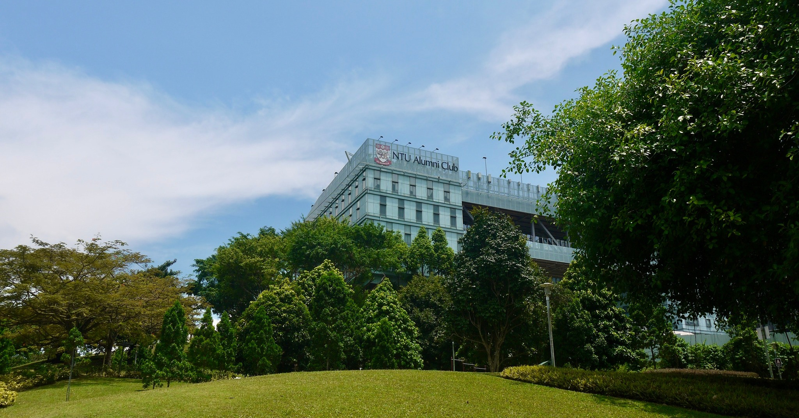
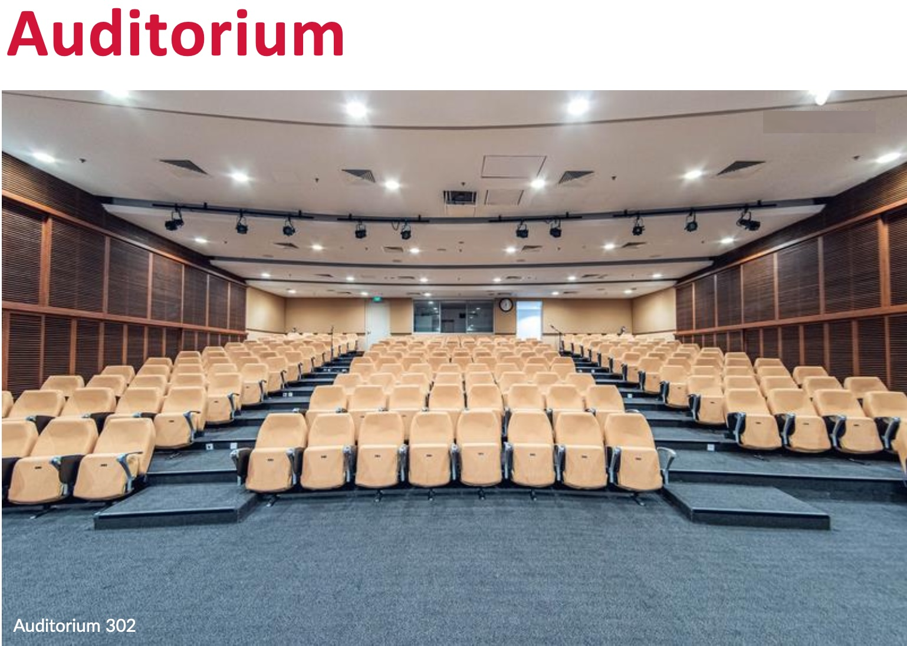
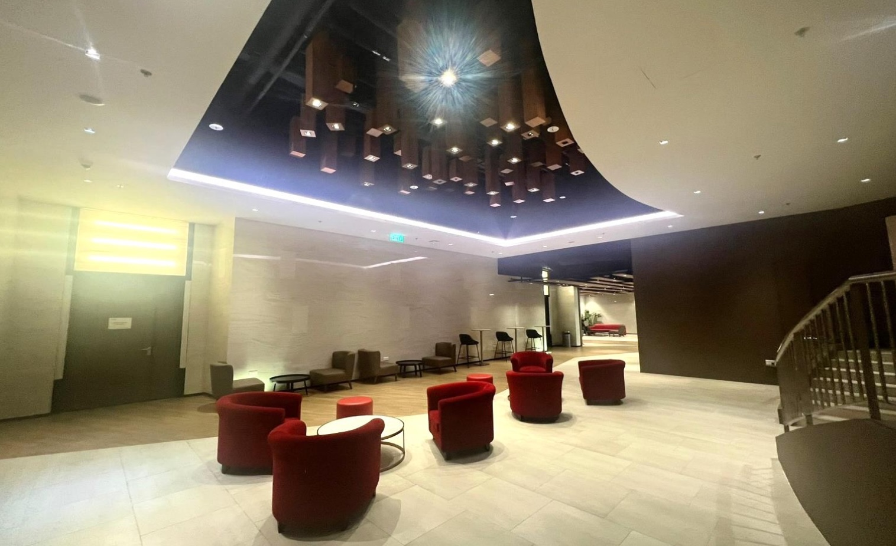

# Conference Venue

  
  

  

    

      

        NTU@one-north, Singapore 
        11 Slim Barracks Rise, Singapore 138664
      

      <a
        href="https://www.ntu.edu.sg/life-at-ntu/leisure-and-dining/ntu@one-north"
        style="background-color: #fff; color: #000; border-radius: 0.25rem; padding: 0.5rem 1rem; text-decoration: none; font-weight: 500; margin-top: 0.5rem; text-shadow: none;"
        target="_blank"
        >Visit</a
      >
    

  

SSDBM 2027 will be held at **NTU@one-north**, Nanyang Technological University's executive education and alumni centre in Singapore's one-north research and innovation district.

The campus is less than a 10-minute walk from Buona Vista MRT station, nearby hotels, and the Star Vista shopping centre. It takes about one hour to reach by MRT from Changi Airport or around 30 minutes by car, depending on traffic. A taxi from Changi Airport typically costs **S$30–S$50**.

## Wi-Fi at the Venue

Three wireless networks are available at NTU@one-north:

- **Eduroam**
- **Guest Wi-Fi** — [register here](https://www3.ntu.edu.sg/cits2/wireless/smsguide/smsguide.htm){:target="_blank"}. A **Singapore-registered mobile number** is required.
- **NTUSECURE** — shared conference logins for attendees without a Singapore-registered mobile number will be provided closer to the conference.

Registration desk location and hours will be published closer to the conference.

## Photos

  

  

  
